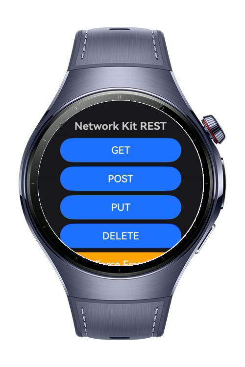
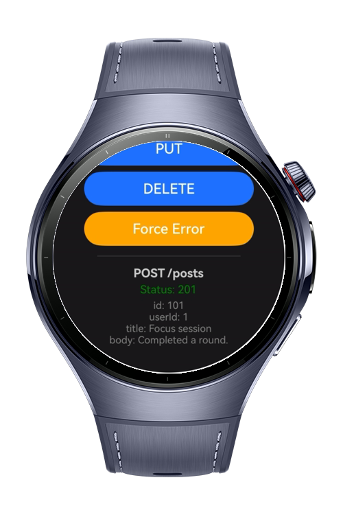
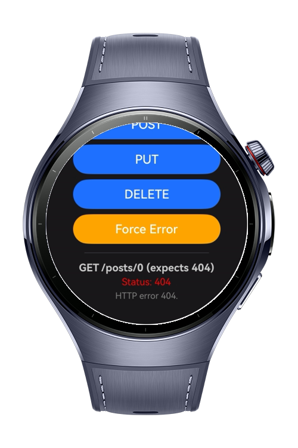

> **Note:** To access all shared projects, get information about environment setup, and view other guides, please visit [Explore-In-HMOS-Wearable Index](https://github.com/Explore-In-HMOS-Wearable/hmos-index).

# How to Make REST API Calls with Network Kit in ArkTS

A HarmonyOS Next codelab app for wearable that shows how to make real REST
API calls with Network Kit. A row of buttons runs GET, POST, PUT, and DELETE
requests against a public REST API, plus a button that triggers a 404 on purpose.
Each call shows its HTTP status code and the parsed result. The project covers the
full request lifecycle, status code validation, retries, header configuration, and
parsing responses into a clean model, all behind an MVVM structure.

# Preview

<div>
  
  
  
  
</div>

# Use Cases

- Send different request types from dedicated buttons: GET, POST, PUT, DELETE.

- See each response in place: the HTTP status code and the parsed body.

- Trigger a 404 on demand to watch status-code validation and error handling work.

- Scoring of results is replaced by clear call feedback: loading, success with a status code, or a typed error message.

- Retry transient failures automatically:

    - Retries timeouts and transient server codes (408, 500, 502, 503, 504).

    - Never retries a 404 or a parse error.

- Configure request headers per verb, including `Content-Type` for bodies and where an `Authorization` header would go.

- Parse the JSON body and map the raw DTO into a clean domain model.

# Technology

## Stack
**Languages**: ArkTS / ArkUI

**Frameworks**: HarmonyOS SDK 5.1.0(18)

**Tools**: DevEco Studio Vers 5.1.0.842

**Libraries**: 
- @kit.NetworkKit, 
- @kit.ArkUI, 
- @kit.AbilityKit, 
- @kit.BasicServicesKit, 
- @kit.PerformanceAnalysisKit

## Required Permissions

- `ohos.permission.INTERNET`
- `ohos.permission.GET_NETWORK_INFO`

# Directory Structure
```
entry/src/main/
├── ets/
│   ├── common/
│   │   └── constants/
│   │       └── NetworkConstants.ets   # Base URL, timeouts, retry policy
│   │
│   ├── model/
│   │   ├── PostResponse.ets           # DTOs mirroring the raw JSON (wire format)
│   │   ├── PostModel.ets              # Clean domain model the UI consumes
│   │   ├── ApiResult.ets              # Status code + parsed data wrapper
│   │   └── ApiError.ets               # Typed error for the request flow
│   │
│   ├── data/
│   │   └── ApiRepository.ets          # All Network Kit logic: GET/POST/PUT/DELETE, status, retry, parse
│   │
│   ├── viewmodel/
│   │   ├── DemoUiState.ets            # UI state: idle, loading, success, error
│   │   └── ApiDemoViewModel.ets       # One action per button, bridges repository and view
│   │
│   ├── utils/
│   │   ├── NetworkUtil.ets            # Checks network availability
│   │   └── PermissionsUtil.ets        # Requests runtime permissions
│   │
│   ├── pages/
│   │   ├── Index.ets                  # Entry page, requests permissions
│   │   └── ApiDemoPage.ets            # Demo screen with buttons (pure View)
│   │
│   └── entryability/
│       └── EntryAbility.ets           # App entry ability
│
├── resources/base/profile/
│   └── main_pages.json                # Page routing
│
└── module.json5                       # App metadata & permissions
```

# Constraints and Restrictions

## Supported Device
- Huawei Watch 5

# License

**How to Make REST API Calls with Network Kit in ArkTS** is distributed under the terms of the MIT License.

See the [LICENSE](/LICENSE) for more information.